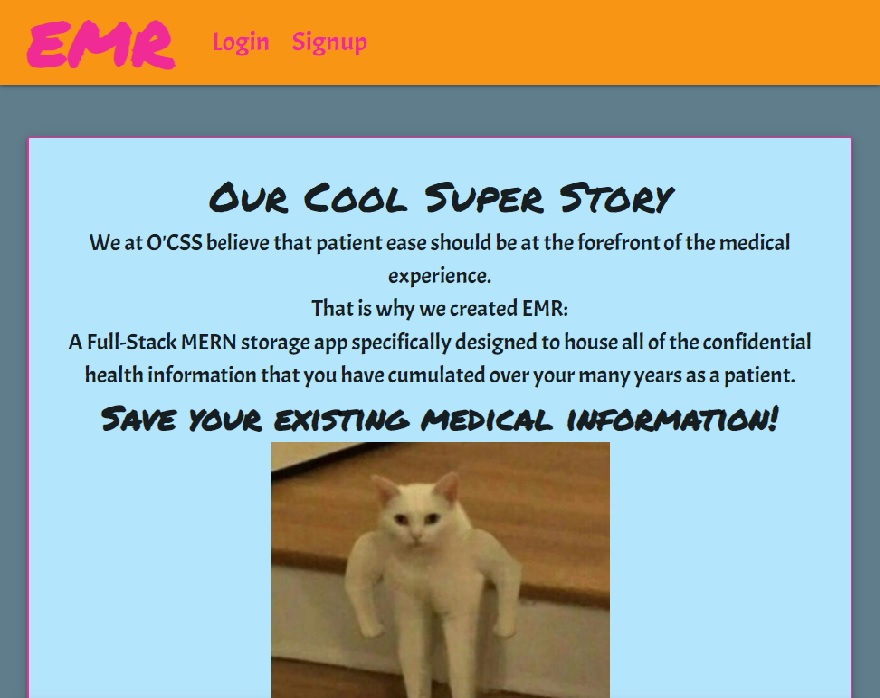
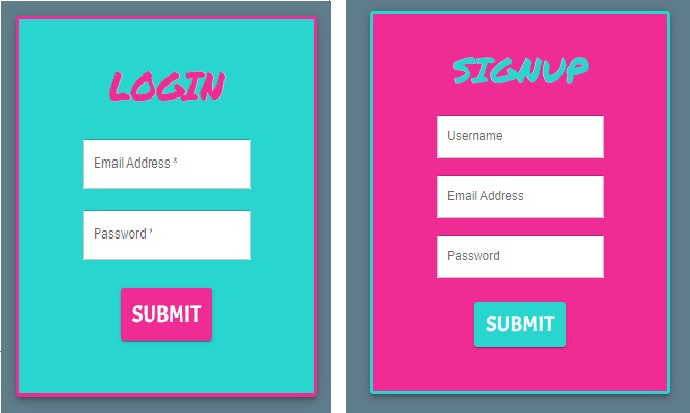
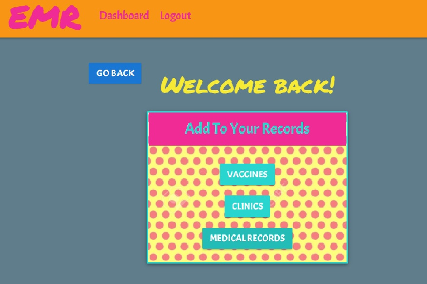
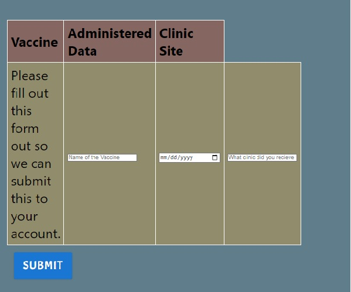
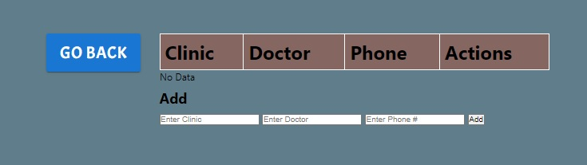

# EMR ( Electronic Medical Records)

# Purpose 
We at O'CSS believe that patient ease should be at the forefront of the medical experience.
That is why we created EMR:
 A Full-Stack MERN storage app specifically designed to house all of the confidential health information that you have cumulated over your many years as a patient.

# Technologies Used
* JavaScript
* CSS
* MUI 
* JWT 
* Apollo Server
* GraphQL
* React

# Heroku Link
https://arcane-hamlet-39116.herokuapp.com/

# Screenshots
Below are screenshots of the deployed project.

# Contributors
* Omar Samudio
* Sara Barnett
* Chris Miller
* Steven Cruz
